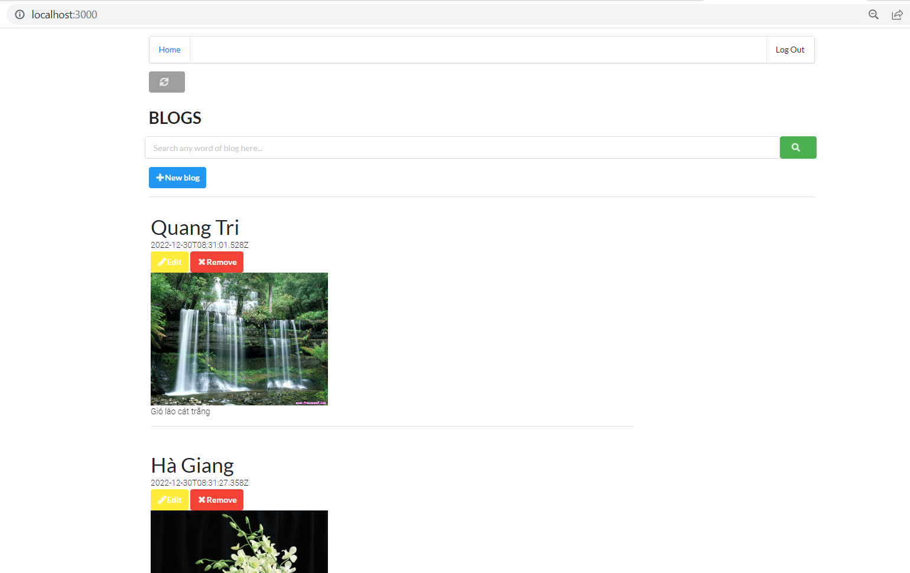
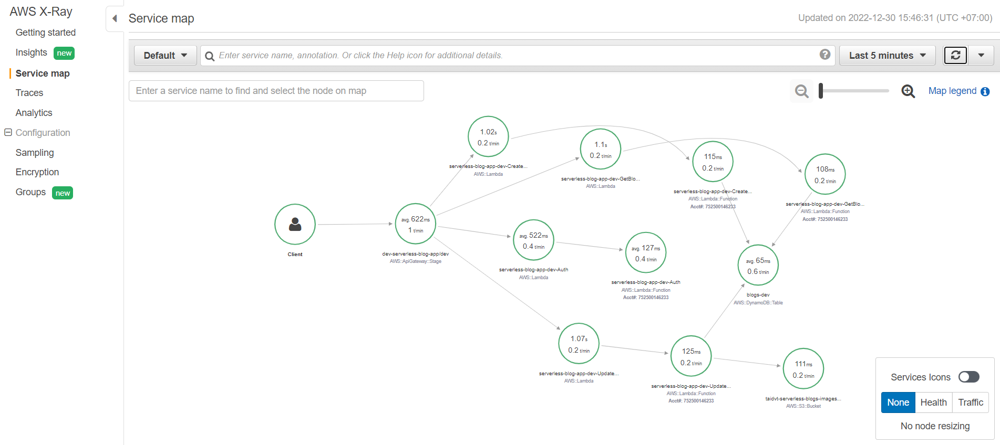
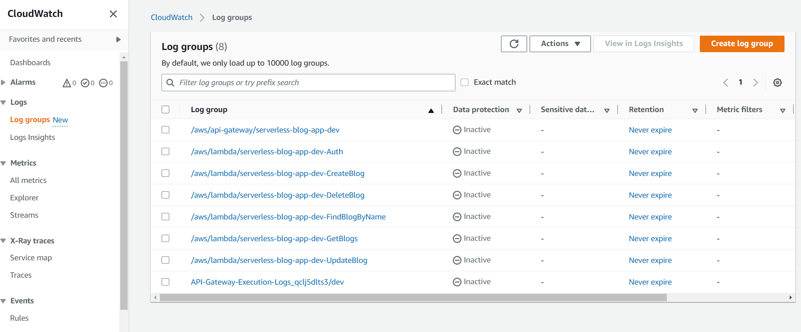
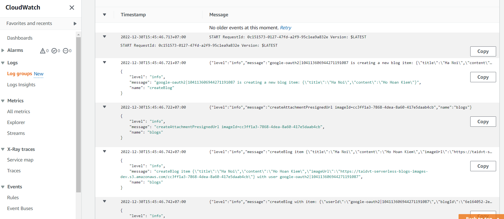

# Udacity - Cloud Developer Nanodegree Capstone Project

## Functionality of the application

The application allows creating/removing/updating/fetching blog items.

<div align="center">
  
</div>

***

## Implemented functions

The following lambda functions have been implemented:
- Auth: Lambda authorizer
- GetBlogs: retrieves all blogs of each user
- FindBlogByName: searches some blogs with input match title or content of blog
- CreateBlog: creates a new blog item
- UpdateBlog: updates a blog item
- DeleteBlog: removes a blog item

All functions are already connected to appropriate events from API Gateway.
An username of a user can be extracted from a JWT token passed by a client.


# How to run the application

## Backend

You don't have to config any more in this section, it's running in lambda !

## Frontend

To run a client application first edit the `client/src/config.ts` file to set correct parameters. And then run the following commands:

```
cd client
npm install
npm run start
```

# Monitoring
## Distributed tracing

X-Ray tracing has been set up

<div align="center">
  
</div>

## Logging

The starter code came with a configured [Winston](https://github.com/winstonjs/winston) logger that creates [JSON formatted](https://stackify.com/what-is-structured-logging-and-why-developers-need-it/) log statements. It is used to write log messages like this:

<div align="center">
  
</div>

```ts
import { createLogger } from '../../utils/logger'
const logger = createLogger('auth')

// You can provide additional information with every log statement
// This information can then be used to search for log statements in a log storage system
logger.info('User was authorized', {
  // Additional information stored with a log statement
  key: 'value'
})
```

<div align="center">
  
</div>

***